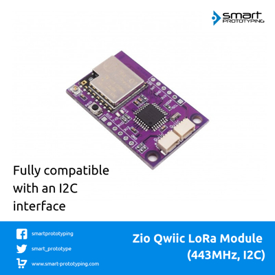

# Zio-Qwiic-Lora-Module-443MHz-I2C

The gateway firmware referred [Sparkfun's QwiicRF](https://github.com/sparkfunx/Qwiic_RF)

> This product can be available for purchase [here](https://www.smart-prototyping.com/Zio-Qwiic-Lora-module-443MHz-I2C).

##### Description

This is a [Qwiic](https://www.smart-prototyping.com/Qwiic.html) version LoRa module, no soldering and jumper wire connections, just [Qwiic cable](https://www.smart-prototyping.com/zio-cables) plugin, and have fun! 

LoRa module is powerful, it can send and receive data packets at up to 10KM distance, and consumes very low power (10mA for receiver, 120mA for transmitter).

LoRa itself is a SPI device, in order to turn it into a I2C device, we added an MCU as the gateway to do the dirty work for you, you just need to use the module’s I2C interface to communicate with the others. It is just that easy.
 

> Note: This LoRa module is based on the LoRa-01 module, the frequency range is 420 - 450 MHz, check [here](https://www.thethingsnetwork.org/docs/lorawan/frequencies-by-country.html) to see if this can be used in your country.

##### Specification

* Voltage: 3.3V
* Interface: I2C
* I2C Address: 0x35, 0x36 (Default: 0x35)
* Distance: Up to 10KM
* Gateway MCU: ATMEGA328P
* Dimension: 26.0 x 41.6 mm
* Weight: 5.3g

##### Links

* [PCB Source file](https://github.com/ZIOCC/Zio-Qwiic-Lora-Module-443MHz-I2C/tree/master/EAGLE)
* [PCB schematic](https://github.com/ZIOCC/Zio-Qwiic-Lora-Module-443MHz-I2C/blob/master/zio%20qwiic%20lora%20module%20433%20schematic.pdf)
* [Demo code](https://github.com/sparkfun/SparkFun_QwiicRF_Library/)
* [Gateway firmware](https://github.com/ZIOCC/Zio-Qwiic-Lora-Module-443MHz-I2C/tree/master/Gateway_Firmware/Qwiic_RF_I2C_Pairing)

> ###### About Zio
> Zio is a new line of open sourced, compact, and grid layout boards, fully integrated for Arduino and Qwiic ecosystem. Designed ideally for wearables, robotics, small-space limitations or other on the go projects. Check out other awesome Zio products [here](https://www.smart-prototyping.com/Zio).

